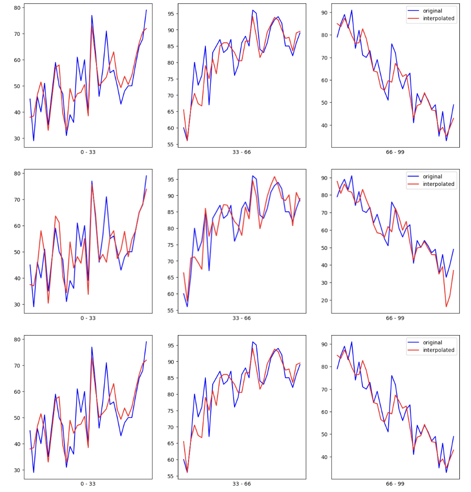

1. Principle component analysis(PCA) for dimentionality reduction.
2. MissingData

# PCA: 

Principal Component Analysis (PCA) is a technique used to reduce the dimensionality of data while preserving its variance. It does this by transforming the original variables into a new set of uncorrelated variables called principal components.
This helps in reducing the execution time and resources used(Although may hinder accuracy - tradeoff). Following are the results:

Without PCA reduction:
CPU times: user 48.1 s, sys: 9.73 s, total: 57.8 s
Wall time: 17 s
Knn score: 0.9705

With PCA reduction:

CPU times: user 1.1 s, sys: 1.47 s, total: 2.56 s
Wall time: 664 ms
Knn score: 0.9246

# MissingData:

Handling numerical missing data using interpolation, spline interpolation, simple imputer, etc

Below is Comparision of fillled NAN values using interpolator, spline interpolator(kind: curve and linear respectively):

